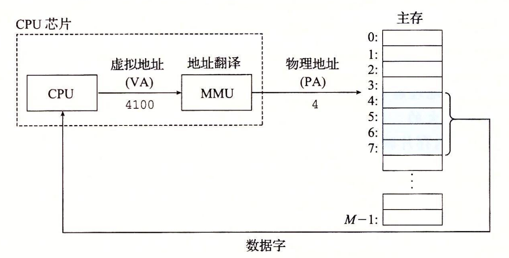

# CSAPP 学习
## 包含一系列 markdown 文件
### 我是菜鸟

使用虚拟寻址，CPU 通过生成一个虚拟地址（Virtual Address，VA）来访问主存，这个虚拟地址在被送到内存之前先转换成适当的物理地址。将一个虚拟地址转换为物理地址的任务叫做地址翻译（address translation）。就像异常处理一样，地址翻译需要 CPU 硬件和操作系统之间的紧密合作。CPU 芯片上叫做内存管理单元（Memory Management Unit，MMU）的专用硬件，利用存放在主存中的查询表来动态翻译虚拟地址，该表的内容由操作系统管理。